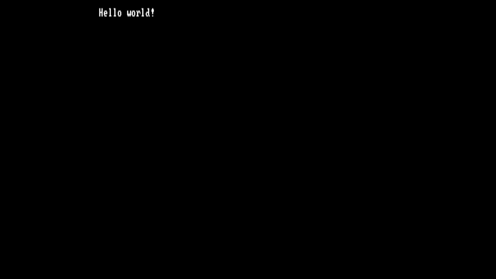

# hello-n64



`Hello world!\n` in N64.
Make sure to install `n64dd.zip` files into `$HOME/.mame/n64dd/`.

```
paru -S git make gcc mips64-elf-gcc mame
git clone https://github.com/knarkzel/hello-n64
cd hello-n64/
make run
```
